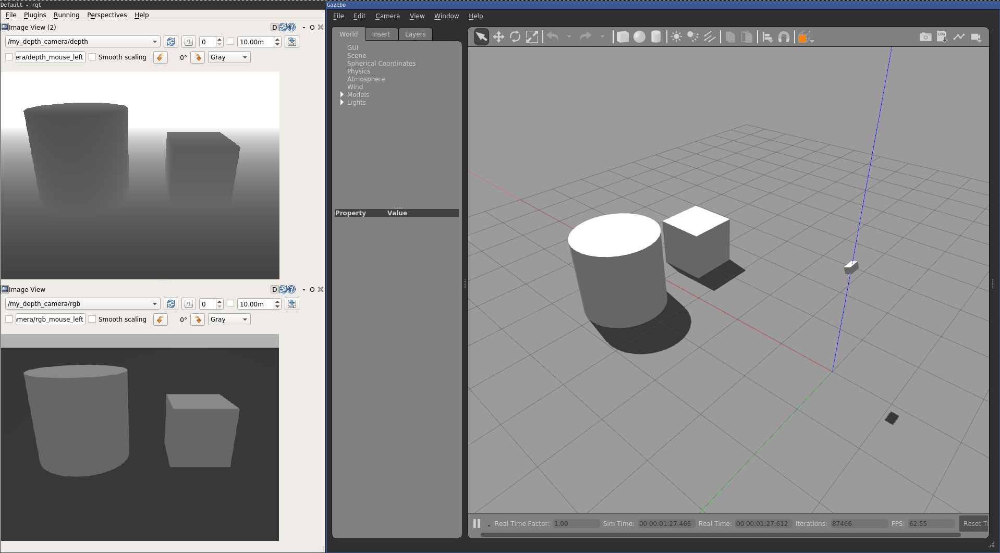

# Gazebo Minimal Example

This tutorial assumes you have familiarized yourself with the
following gazebo tutorials:

- [Gazebo Components](http://gazebosim.org/tutorials?tut=components&cat=get_started)
- [What are gazebo plugins](http://gazebosim.org/tutorials?tut=plugins_hello_world&cat=write_plugin)
- [How to write a ModelPlugin](http://gazebosim.org/tutorials?tut=plugins_model&cat=write_plugin)

Pre-requisit checklist:

- How to use ROS
- How to create gazebo world files
- How to create gazebo model files
- How to write a gazebo plugin (namely a world, model and sensor plugin)

If you don't know one of the above pre-requisit the following tutorial will not
make much sense to you.

Other useful resources:
- [Gazebo API][api]
- [SDF Specification][sdf]

## Build and launch example

    cd <path to your catkin workspace>/src
    git clone git@bitbucket.org:smartroboticslab/gazebo_minimal_example.git
    catkin build gazebo_minimal_example -DCMAKE_BUILD_TYPE=Release -j2

    source <path to your catkin workspace>/devel/setup.bash
    roslaunch gazebo_minimal_example sim_depth_camera.launch

## How to add a depth camera to Gazebo?

This tutorial shows how one can create a gazebo model and simulate a depth
sensor in the simulation. The end result should look something like this

### Create the depth sensor model

In order to have a depth sensor in the simulation we must first build a model.
In gazebo the model file structure for defining a model is as follows:

    model_name/
        model.config
        model.sdf

In `model.sdf` we can define the model of the depth camera as a simple box
geometry of size 0.1m x 0.2m x 0.1m (w x d x h).

    <?xml version="1.0" ?>
    <sdf version="1.5">
      <model name="depth_camera">

        <link name="link">
          <visual name="visual">
            <geometry>
              <box>
                <size>0.1 0.2 0.1</size>
              </box>
            </geometry>
          </visual>

          <sensor name="depth_camera" type="depth">
            <camera name="__default__">
              <horizontal_fov>1.047</horizontal_fov>
              <image>
                <width>640</width>
                <height>480</height>
              </image>
              <clip>
                <near>0.1</near>
                <far>100</far>
              </clip>
              <noise>
                <type>gaussian</type>
                <mean>0.0</mean>
                <stddev>0.007</stddev>
              </noise>
            </camera>
            <always_on>1</always_on>
            <update_rate>60</update_rate>
            <visualize>true</visualize>

            <plugin name="my_depth_plugin" filename="libmy_depth_plugin.so">
              <topic_name>/my_depth_camera/depth</topic_name>
            </plugin>
          </sensor>
        </link>
      </model>
    </sdf>

To tell gazebo that the box represents a depth sensor we use the `<sensor>` tag
with a type `depth`. For more options look at the `Sensors` element
specifications [here](http://sdformat.org/spec?ver=1.7&elem=sensor). **Note**:
Other than defining the depth sensor's properties, we have also defined our own
custom gazebo plugin called `libmy_depth_plugin.so`. This custom plugin is how
the depth image rendered by gazebo will be made accessible via ROS messages.

**Pro-Tip**: You may put plugin specific parameters inside the `<plugin>` tag
and parse it in the plugin code. In the above I have used `<topic_name>` to
store the desired ROS topic to transmit the depth data to.

**IMPORTANT**: The name of the plugin / filename must be unique, if you named
your plugin with a generic name it may clash with gazebo's built in plugins.

### Add the model to the world

Once the depth camera model is defined, to load it simply include it in the
world file of choice. In this example we have placed it in
`worlds/sim_depth_camera.world`.

    <?xml version="1.0"?>
    <sdf version="1.6">
      <world name="default">
        <!-- GUI -->
        <gui>
          <camera name="gui_camera">
            <pose>-2.6 5.6 5.9 0.0 0.6 -0.85</pose>
          </camera>
        </gui>

        <!-- Lighting -->
        <include>
          <uri>model://sun</uri>
        </include>

        <!-- Ground -->
        <include>
          <uri>model://ground_plane</uri>
        </include>

        <!-- Box -->
        <include>
          <uri>model://box</uri>
          <pose>0.0 -0.5 0.25 0.0 0.0 0.0</pose>
          <static>true</static>
        </include>

        <!-- Cylinder -->
        <include>
          <uri>model://cylinder</uri>
          <pose>0.0 0.5 0.3 0.0 0.0 0.0</pose>
          <static>true</static>
        </include>

        <!-- Depth Camera -->
        <include>
          <uri>model://depth_camera</uri>
          <pose>-2.0 0.0 1.0 0.0 0.4 0.0</pose>
          <static>true</static>
        </include>
      </world>
    </sdf>

### Create depth sensor plugin

Gazebo is one of the default simulators for ROS, however, internally the
components talk to each other via google's ProtoBuf message passing protocol,
instead of ROS messages. In our plugin, the goal is to obtain the depth image
rendered by gazebo and transmit the data using ROS. Specifically we will be
transmitting a `sensor_msgs::Image` message in the plugin with the following
code:

    #include <functional>

    #include <gazebo/gazebo.hh>
    #include <gazebo/common/common.hh>
    #include <gazebo/common/Plugin.hh>
    #include <gazebo/sensors/sensors.hh>
    #include <gazebo/physics/physics.hh>
    #include <gazebo/rendering/rendering.hh>
    #include <gazebo/rendering/DepthCamera.hh>
    #include <ignition/math/Vector3.hh>

    #include <cv_bridge/cv_bridge.h>
    #include <image_transport/image_transport.h>

    namespace gazebo {

    struct MyDepthPlugin : public SensorPlugin {
      // Gazebo
      sdf::ElementPtr sdf_;
      event::ConnectionPtr depth_conn_;
      event::ConnectionPtr rgb_conn_;
      rendering::ScenePtr scene_;
      sensors::DepthCameraSensorPtr sensor_;
      rendering::DepthCameraPtr depth_camera_;

      // ROS
      size_t seq_ = 0;
      std::string depth_topic_ = "depth";
      std::string rgb_topic_ = "rgb";
      std::thread ros_thread_;
      ros::NodeHandle *ros_nh_;
      image_transport::ImageTransport *img_transport_;
      image_transport::Publisher depth_pub_;
      image_transport::Publisher rgb_pub_;

      MyDepthPlugin() {}
      ~MyDepthPlugin() {
        delete ros_nh_;
        delete img_transport_;
      }

      void Load(sensors::SensorPtr sptr, sdf::ElementPtr sdf) {
        sdf_ = sdf;

        // Load sensor pointer
        sensor_ = std::dynamic_pointer_cast<sensors::DepthCameraSensor>(sptr);
        if (!sensor_) {
          gzerr << "MyDepthPlugin requires a DepthSensor.\n";
        }

        // Load depth camera
        depth_camera_ = sensor_->DepthCamera();
        if (!depth_camera_) {
          gzerr << "MyDepthPlugin not attached to a camera sensor!\n";
          return;
        }

        // Register depth callback
        auto depth_cb = std::bind(&MyDepthPlugin::depth_update, this);
        depth_conn_ = depth_camera_->ConnectNewDepthFrame(depth_cb);

        // Register rgb callback
        auto rgb_cb = std::bind(&MyDepthPlugin::rgb_update,
                                this,
                                std::placeholders::_1,
                                std::placeholders::_2,
                                std::placeholders::_3,
                                std::placeholders::_4,
                                std::placeholders::_5);
        rgb_conn_ = depth_camera_->ConnectNewImageFrame(rgb_cb);

        // Create ROS thread
        ros_thread_ = std::thread(&MyDepthPlugin::ros_thread, this);
      }

      void ros_thread() {
        // Initialize ros node
        if (ros::isInitialized() == false) {
          ROS_FATAL("ROS is not initialized!");
        }
        ros_nh_ = new ros::NodeHandle();

        // Get rostopic names from sdf file
        if (sdf_->HasElement("depth_topic")) {
          depth_topic_ = sdf_->Get<std::string>("depth_topic");
        }
        if (sdf_->HasElement("rgb_topic")) {
          rgb_topic_ = sdf_->Get<std::string>("rgb_topic");
        }

        // Register publisher
        int queue_size = 1;
        img_transport_ = new image_transport::ImageTransport(*ros_nh_);
        depth_pub_ = img_transport_->advertise(depth_topic_, 1);
        rgb_pub_ = img_transport_->advertise(rgb_topic_, 1);
      }

      void depth_update() {
        // Get sim time
        rendering::ScenePtr scene = depth_camera_->GetScene();
        common::Time timestamp = scene->SimTime();

        // Get data dimensions
        const int image_width = depth_camera_->ImageWidth();
        const int image_height = depth_camera_->ImageHeight();

        // Convert data to cv::Mat
        cv::Mat depth_image(image_height, image_width, CV_32FC1,
                            (void *) depth_camera_->DepthData());

        // Form std_msgs::Header
        std_msgs::Header header;
        header.seq = seq_;
        header.stamp = ros::Time(timestamp.sec, timestamp.nsec);
        header.frame_id = depth_topic_;

        // Form sensor_msgs::Image for depth
        cv_bridge::CvImage depth_ros;
        depth_ros.header = header;
        depth_ros.encoding = sensor_msgs::image_encodings::TYPE_32FC1;
        depth_ros.image = depth_image;

        // Publish depth
        depth_pub_.publish(depth_ros.toImageMsg());
      }

      void rgb_update(const unsigned char *image_raw,
                      const int image_width,
                      const int image_height,
                      const int image_depth,
                      const std::string &format) {
        // Get sim time
        rendering::ScenePtr scene = depth_camera_->GetScene();
        common::Time timestamp = scene->SimTime();

        // Convert data to cv::Mat
        const int buffer_size = image_width * image_height * 3;
        unsigned char *buffer = new unsigned char[buffer_size + 1];
        memcpy((char *) buffer, image_raw, buffer_size);
        const cv::Mat image(image_height, image_width, CV_8UC3, buffer);

        // Build std_msgs::Header
        std_msgs::Header header;
        header.seq = seq_;
        header.stamp = ros::Time(timestamp.sec, timestamp.nsec);
        header.frame_id = rgb_topic_;

        // Build sensor_msgs::Image
        const auto img_msg = cv_bridge::CvImage(header, "rgb8", image).toImageMsg();

        // Publish image and clean up
        rgb_pub_.publish(img_msg);
        delete[] buffer;
      }
    };

    GZ_REGISTER_SENSOR_PLUGIN(MyDepthPlugin)
    } // namespace gazebo

Hopefully the comments in the code are self-explanatory, one thing that is
worth noting is that we have a thread within the plugin that acts as a ROS
node, so that whenever the plugin receives a depth image from gazebo, we
convert the depth and rgb data image and publish the data as a
`sensor_msgs::Image` ROS message. The topic names for the data to be published
to are defined in the `model.sdf` file:

    <plugin name="my_depth_plugin" filename="libmy_depth_plugin.so">
      <depth_topic>/my_depth_camera/depth</depth_topic>
      <rgb_topic>/my_depth_camera/depth</rgb_topic>
    </plugin>

and obtained in the code above with:

    // Get rostopic names from sdf file
    if (sdf_->HasElement("depth_topic")) {
      depth_topic_ = sdf_->Get<std::string>("depth_topic");
    }
    if (sdf_->HasElement("rgb_topic")) {
      rgb_topic_ = sdf_->Get<std::string>("rgb_topic");
    }

### Finish up and voila!

To recap, we have:

1. Created a depth camera model
2. Added the depth camera model to the world
3. Created a custom gazebo sensor plugin that would transmit depth map via ROS

Finally, to put eveything together we have to define a `roslaunch` file, lets
call it `sim_depth_camera.launch`:

    <launch>
      <!-- Settings -->
      <env name="GAZEBO_MODEL_PATH" value="$(find gazebo_minimal_example)/models:$(optenv GAZEBO_MODEL_PATH)" />
      <env name="GAZEBO_RESOURCE_PATH" value="$(find gazebo_minimal_example)/worlds:$(optenv GAZEBO_RESOURCE_PATH)" />

      <!-- Gazebo -->
      <include file="$(find gazebo_ros)/launch/empty_world.launch">
        <arg name="world_name" value="$(find gazebo_minimal_example)/worlds/sim_depth_camera.world" />
        <arg name="use_sim_time" value="true" />
        <arg name="verbose" value="true" />
        <arg name="headless" value="false" />
        <arg name="debug" value="false" />
        <arg name="paused" value="false" />
        <arg name="gui" value="true" />
      </include>
    </launch>

The lines defining `GAZEBO_MODEL_PATH` and `GAZEBO_RESOURCE_PATH` are
particularly important, this sets the repective environment variables that
tells gazebo where to find our model and world files we have created. Then
using the `gazebo_ros` package we load our custom `sim_depth_camera.world`
containing lighting, scene objects (cyclinder and a cube) as well as our depth
camera.

Then simply launch the whole example with:

    source <path to catkin workspace>/devel/setup.bash
    roslaunch gazebo_minimal_example sim_depth_camera.launch

[api]: https://osrf-distributions.s3.amazonaws.com/gazebo/api/dev/index.html
[sdf]: http://sdformat.org/spec
